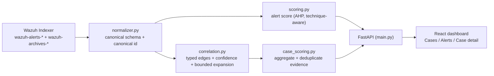

<p align="center">
  
</p>

<p align="center">
  <b>Alert dan correlated case Wazuh/Sysmon dinilai 0–100 berdasarkan kelengkapan bukti — bukan sekadar apakah alert-nya menyala.</b><br>
  <sub>AHP-weighted, technique-aware, correlation-based actionability scoring.</sub>
</p>

<p align="center">
  <a href="#testing"></a>
  <a href="#quick-start"></a>
  <a href="#api-endpoints"></a>
  <a href="#dashboard"></a>
  
  
  <a href="https://github.com/kavakoss/actionability-scoring-dashboard/commits/main"></a>
</p>

---

## Tentang

**Actionability Scoring** adalah prototype sistem untuk skripsi *Context-Aware Telemetry Observability Evaluation Agent for MITRE ATT&CK-Aligned Wazuh Events*. Sistem ini **bukan alat deteksi baru**. Dia menjawab pertanyaan yang berbeda:

> "Alert atau kasus yang sudah terbentuk ini sudah cukup lengkap untuk diinvestigasi, atau masih perlu hunting manual?"

Jawabannya diukur sebagai **actionability score 0–100**, dihitung **per alert** dan **per correlated case**.

### Masalah yang diselesaikan

- Alert Wazuh + Sysmon sering **minim konteks**: ada indikasi eksekusi, tetapi command line, parent process, user, atau network destination tidak ada di alert tersebut.
- MITRE ATT&CK mapping tidak sama dengan kualitas deteksi (Shen et al., 2024); SOC analyst juga sudah kelebihan alert (Alahmadi et al., 2022).
- Kualitas telemetri jarang diukur secara kuantitatif. Sistem ini menyediakan ukurannya, sekaligus menunjukkan bukti mana yang hilang sehingga konfigurasi logging bisa diperbaiki.

## Fitur

- **Alert-level actionability score** — bobot field dihitung dengan **AHP (Saaty)**, divalidasi Consistency Ratio (< 0.10), dan dihitung hanya atas field yang diharapkan untuk teknik tersebut (technique-aware).
- **Typed-edge correlation** — event dihubungkan dengan relationship bertipe dan ber-confidence (`SAME_PROCESS`, `PARENT_CHILD`, `SAME_BINARY`, `PROCESS_CONNECTED_TO`, `DESTINATION_SHARED`, …), bukan sekadar "ada field yang sama".
- **Case-level actionability score** — bukti lintas event diagregasi dan dideduplikasi, lalu dinilai dengan `Q` (completeness, validity, corroboration, provenance) dikali confidence relasi.
- **Bounded expansion** — graf tidak meledak: depth ≤ 3, node cap, context leaf cap, dan hanya edge identity-backed yang boleh rekursi.
- **Seed policy critical-only** — hanya alert `rule.level >= SEED_MIN_LEVEL` yang menjadi case; evidence pendukung tetap diambil dari `alerts` + `archives` tanpa batas level.
- **Dashboard console-style** — halaman Cases & Alerts, tabel bukti (W/Q/E + sumber event), typed relations, timeline dengan chip relasi, export laporan Markdown.
- **Mock/Live switch** — demo deterministik tanpa Wazuh, atau data live dari Wazuh Indexer, bisa diganti saat runtime dari UI.
- **Reproducible artifacts** — `weights.json`, `AHP_RESULTS.md`, `data/mitre_traceability.csv` (field → OSSEM → MITRE component → bobot).
- **43 automated tests** — AHP, normalizer, correlation, scoring, case scoring.

## Screenshots

Screenshot diambil dari mode **MOCK** (fixture deterministik) agar demo dapat direproduksi.

| Cases | Case detail |
|---|---|
|  |  |

| Alerts | |
|---|---|
|  | Tabel bukti menampilkan weight, quality `Q`, evidence confidence `E`, kontribusi, dan carrier sumber (index + document id). |

## Cara kerja



1. **Ingest** — event ditarik dari `wazuh-alerts-*` (dan `wazuh-archives-*` untuk evidence) memakai `term` query pada field keyword.
2. **Normalize** — field Wazuh dipetakan ke skema kanonik (`process.guid`, `file.hash.sha256`, `destination.ip`, …) + ID kanonik supaya salinan event di alerts dan archives tidak terhitung dobel.
3. **Score (alert)** — `S_alert = 100 × Σ(w_f·A_f) / Σ w_f` atas field yang diharapkan untuk teknik.
4. **Correlate** — pasangan event divalidasi menjadi relasi bertipe dengan confidence `C`, lalu diekspansi terbatas.
5. **Score (case)** — bukti diagregasi, dideduplikasi, dan dinilai `Q × E` per fakta.
6. **Serve** — FastAPI + React dashboard.

## Model scoring

Bobot dihasilkan dari matriks pairwise di `backend/ahp/matrices.py` dan disimpan di `backend/weights.json` (single source of truth). Regenerate dengan:

```bash
cd backend
python -m ahp.run_ahp
# → weights.json, AHP_RESULTS.md, data/mitre_traceability.csv
```

**Alert score** — hanya atas field yang diharapkan untuk teknik tersebut:

```text
w_f     = category_weight × local_field_weight          (global weight)
S_alert = 100 × Σ (w_f × A_f) / Σ w_f
A_f     = 1 jika field ada dan non-empty, else 0
```

**Relationship confidence** (typed edge):

```text
C_r = 0.45·P + 0.20·T + 0.15·H + 0.10·S + 0.10·X
P = pivot strength, T = temporal decay e^(−Δt/τ),
H = host consistency, S = session/user consistency, X = corroborating evidence
```

**Case score** — bukti lintas event, dideduplikasi, dibobot kualitas dan confidence:

```text
Q_f    = 0.30·C + 0.30·V + 0.25·K + 0.15·R
         C = completeness, V = validity, K = confidence-weighted corroboration,
         R = provenance
S_case = 100 × Σ (w_f × Q_f × E_f) / Σ w_f
E_f    = confidence jalur seed → event yang membawa fakta (1.0 untuk fakta seed)
```

Level: **Low < 25**, **Medium 25–50**, **High > 50** (provisional; dikalibrasi pada fase evaluasi).
Role `required` / `supporting` / `context` adalah klasifikasi operasional penelitian, bukan label wajib resmi MITRE.

### Kenapa case score bisa 100 sedangkan alert score tidak?

Alert EID 1 tidak punya destination IP dan alert EID 3 tidak punya command line — jadi skor alert memang dibatasi tipe event. Case score menggabungkan EID 1 + EID 3 dari proses yang sama, sehingga seluruh evidence yang diharapkan bisa terpenuhi. Di sinilah korelasi menambah nilai.

## Model korelasi

- **Pivot strength**: `process.guid` 1.00, `parent.child.guid` 0.98, SHA-256 0.95, destination tuple 0.80, destination IP saja 0.45, user 0.35.
- **Relasi bertipe**: `SAME_PROCESS`, `PARENT_CHILD`, `SAME_BINARY`, `PROCESS_CONNECTED_TO`, `PROCESS_QUERIED_DNS`, `PROCESS_CREATED_FILE`, `PROCESS_MODIFIED_REGISTRY`, `PROCESS_TERMINATED`, `DESTINATION_SHARED`, `SUPPORTING_CONTEXT`.
- **Bounded expansion**: depth ≤ 3, hanya edge identity-backed yang boleh direkursi; scope/context edge tidak pernah menjadi titik ekspansi (mencegah graph explosion).
- **Deduplication**: fakta berulang dikumpulkan sebagai satu evidence dengan `occurrences` + carrier terbatas, sehingga ratusan event network identik tidak menggelembungkan skor.
- **Caps**: maksimal 5 context leaf per node; konsistensi dihitung dari maksimal 3 carrier terkuat (identity penuh, context setengah).

## Seed policy (live)

- Hanya alert dengan `rule.level >= SEED_MIN_LEVEL` (default 15; env/API-configurable) yang menjadi **seed/case**. Alert non-critical tidak ditampilkan.
- **Evidence pendukung tidak dibatasi**: saat seed dibuka, sistem melakukan bounded expansion ke `wazuh-alerts-*` **dan** `wazuh-archives-*` — proses yang sama, parent/child, hash, destination, user — sehingga konteks bisa datang dari event mana pun.
- Ubah threshold lewat `.env`, atau `POST /api/source {"source": "live", "seed_min_level": 12}`.
- Filter level hanya berlaku di mode live; mock tetap memuat seluruh fixture.

## Quick Start

### Docker (nginx, port 8080)

```bash
git clone https://github.com/kavakoss/actionability-scoring-dashboard.git
cd actionability-scoring-dashboard
cp backend/.env.example backend/.env   # edit hanya kalau memakai Indexer asli
docker-compose up --build
```

| URL | Keterangan |
|---|---|
| `http://localhost:8080` | Dashboard React |
| `http://localhost:8080/docs` | Swagger API |
| `http://localhost:8080/api/health` | Health check |

```bash
docker-compose down   # stop
```

### Manual (development)

```bash
# terminal 1 — backend
cd backend
python -m venv .venv && source .venv/bin/activate
pip install -r requirements.txt
python main.py                                  # http://localhost:8000

# terminal 2 — frontend
cd frontend
npm install
npm run dev                                     # http://localhost:3000
```

Vite dev server mem-proxy `/api` ke `http://localhost:8000` (override dengan `VITE_API_TARGET`).

### Testing

```bash
cd backend
pytest -q          # 43 tests: AHP, normalizer, correlation, scoring, case scoring
```

## Dashboard

### Cases (default)
- Daftar correlated case diurutkan berdasarkan case score, dengan required-evidence coverage dan ukuran graph.
- Filter by technique / level.

### Case detail
- Case score, required coverage, jumlah node/edge.
- Evidence facts: field, role, AHP weight, `Q`, `E`, kontribusi, dan carrier (nilai + index/document id sumber).
- Toggle **Hide missing**; tombol **Export report** menghasilkan Markdown.
- Score composition dan typed relations (relation, confidence, decision).
- Case timeline dengan chip relasi inline antar event.
- Deep link: `?view=cases&case=<id>`, `?view=alerts&alert=<id>`.

### Alerts
- Skor per-alert (AHP, technique-aware) dengan filter technique/level.
- Klik alert → breakdown per kategori (identity, behavioral, relationship, IOC, network, timeline) lengkap dengan MITRE data component tiap field.

## API Endpoints

| Method | Endpoint | Description |
|---|---|---|
| GET | `/api/health` | Health check + current source + `seed_min_level` |
| GET | `/api/source` | Current source, availability, config |
| POST | `/api/source` | Switch source: `{"source": "mock" \| "live", "seed_min_level": 12}` |
| GET | `/api/alerts` | List seed alerts (`?technique=&level=&agent=&sort_by=score`) |
| GET | `/api/alerts/{id}` | Alert detail + full scoring breakdown |
| GET | `/api/cases` | List cases + case-level score (`?technique=&level=`) |
| GET | `/api/cases/{case_id}` | Case detail: per-fact evidence (Q, E, carriers) + required coverage |
| GET | `/api/timeline/{id}` | Timeline (nodes + typed edges), dari expansion bila tersedia |
| POST | `/api/webhook` | Wazuh integration: alert → bounded expansion → case score |
| GET | `/api/stats` | Aggregate statistics |
| GET | `/docs` | Swagger UI |

## Artefak untuk paper

| File | Isi | Dipakai untuk |
|---|---|---|
| `backend/weights.json` | Bobot AHP final (per kategori & field) | single source of truth |
| `backend/AHP_RESULTS.md` | Semua matriks pairwise, λmax, CI, CR, global weights | lampiran + methodology |
| `backend/data/mitre_traceability.csv` | `technique → field → role → weight → Wazuh path → OSSEM → MITRE component` | content validity |
| `backend/field_metadata.py` | Sumber mapping field | reproducibility |
| `backend/technique_profiles.py` | Expected fields per teknik + kutipan data source | methodology |
| `evaluation/` | Runbook ART, script orkestrator, template `runs.csv` | bab evaluasi |

## Struktur project

```
actionability-scoring-dashboard/
├── backend/
│   ├── main.py                # FastAPI server + source switching + seed policy
│   ├── normalizer.py          # canonical schema (OSSEM-referenced)
│   ├── correlation.py         # typed edges, confidence, bounded expansion
│   ├── case_scoring.py        # case-level Q/E scoring + caps
│   ├── scoring.py             # alert-level AHP scoring (technique-aware)
│   ├── field_metadata.py      # Wazuh path → OSSEM → MITRE component
│   ├── technique_profiles.py  # expected fields per ATT&CK technique
│   ├── wazuh_client.py        # OpenSearch client, pivot queries
│   ├── mock_data.py           # mock alerts (deterministic demo/tests)
│   ├── ahp/                   # AHP core, pairwise matrices, generator
│   ├── data/                  # generated: traceability CSV
│   ├── weights.json           # generated: AHP weights
│   ├── AHP_RESULTS.md         # generated: full AHP report
│   ├── live_demo.py           # CLI: bounded live case expansion
│   ├── tests/                 # pytest suite (43 tests)
│   └── requirements.txt
├── frontend/
│   └── src/
│       ├── App.jsx            # shell, tabs, source toggle, deep links
│       ├── api.js
│       └── components/
│           ├── CasesView.jsx      # case list
│           ├── CaseDetail.jsx     # case score + evidence + export
│           ├── TimelineView.jsx   # timeline with inline relation chips
│           ├── ScoringDashboard.jsx / AlertDetail.jsx / StatsOverview.jsx
│           └── ui.jsx             # design primitives
├── evaluation/
│   ├── ART_RUNBOOK.md         # prosedur manual ART
│   ├── runs.csv               # template log run
│   └── windows/
│       ├── Invoke-ArtPlan.ps1 # orkestrator ART (Pilot/Unattended)
│       └── STEP-BY-STEP.md    # panduan operator
├── docs/
│   ├── banner.svg
│   └── screenshots/
├── nginx/                     # reverse proxy untuk docker-compose
└── docker-compose.yml
```

## Limitations

- Lab terbatas: 1 Windows endpoint, 3 teknik (T1059.001, T1059.003, T1105), Sysmon EID 1/3/5.
- Sysmon EID 22 (DNS) praktis tidak aktif → pivot DNS tidak dipakai; registry/file/pipe pivot belum tersedia.
- SHA-256 pivot live memakai exact `term` pada field `hashes`; data lab berisi satu hash SHA256 per field. Kalau konfigurasi Sysmon mengirim beberapa algoritma dalam satu string, perlu ingest normalization atau query fallback.
- EID 5 (Process Termination) **tidak** dipakai untuk scoring (bukan data component ATT&CK untuk 3 teknik ini) — hanya untuk correlation/lifetime.
- Archives retention terbatas; Process Create milik proses yang sudah berjalan sebelum archive window hilang → lineage bisa terputus.
- `originalFileName` dan `signatureStatus` tidak punya atribut OSSEM CDM (tercatat di traceability CSV).
- Role `required`/`supporting`/`context` adalah klasifikasi operasional penelitian, bukan label wajib resmi MITRE.
- Threshold Low/Medium/High masih provisional sampai kalibrasi di fase evaluasi.
- Skor mengukur **kelengkapan bukti**, bukan tingkat kebahayaan; adversary yang mengisi field bisa menaikkan skor.
- API prototype belum memiliki authentication; jalankan hanya di trusted lab network/Tailscale, jangan expose ke public internet.

## Status & roadmap

| Fase | Status |
|---|---|
| Normalizer + typed-edge correlation engine | selesai |
| AHP weights + technique profiles + traceability artifacts | selesai |
| Alert-level + case-level scoring | selesai |
| Dashboard (Cases/Alerts/Case detail) + MOCK/LIVE switch | selesai |
| Seed policy critical-only + unrestricted case evidence | selesai |
| Runbook + script ART untuk data berlabel | selesai |
| Fase evaluasi: sensitivity A/B, ablation korelasi, discrimination, kalibrasi threshold, weight perturbation | berjalan |
| Penulisan paper (Bab 4/5) | menyusul |

## Troubleshooting

| Masalah | Solusi |
|---|---|
| Backend tidak start (port 8000 terpakai) | Ubah port di `main.py` (`uvicorn.run(app, port=8001)`) |
| Frontend tidak bisa akses API | Pastikan backend jalan; cek `VITE_API_TARGET` / `vite.config.js` |
| `npm install` gagal | Coba `npm install --legacy-peer-deps` |
| Live mode kosong / error | Cek `last_error` di `/api/health`; pastikan `.env` benar dan Indexer reachable |
| Dashboard live kosong padahal ada alert | Turunkan `SEED_MIN_LEVEL` (lab ini maksimum level 12) |
| Halaman blank | Cek console browser (F12) |

## Authors

Jason Tanuwidjaja · Johan Davin Hermawan · Kevin Diaz Pramono — Computer Science, Bina Nusantara University.

Skripsi: *Context-Aware Telemetry Observability Evaluation Agent for MITRE ATT&CK-Aligned Wazuh Events*.
