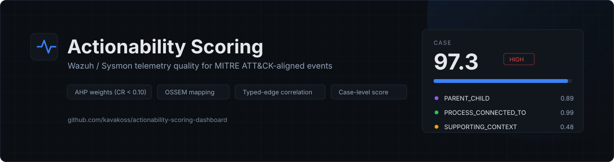
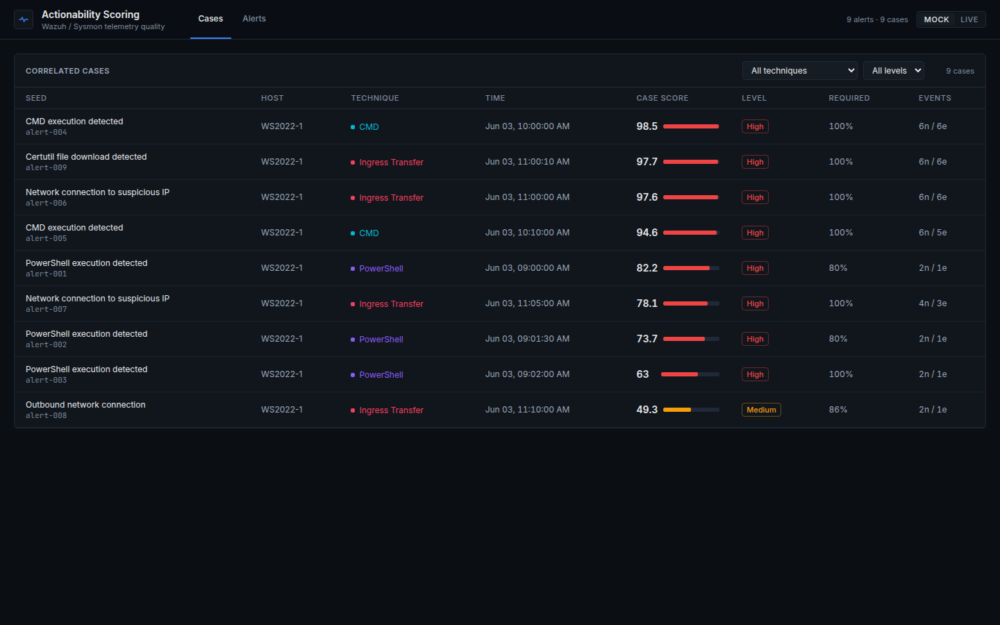
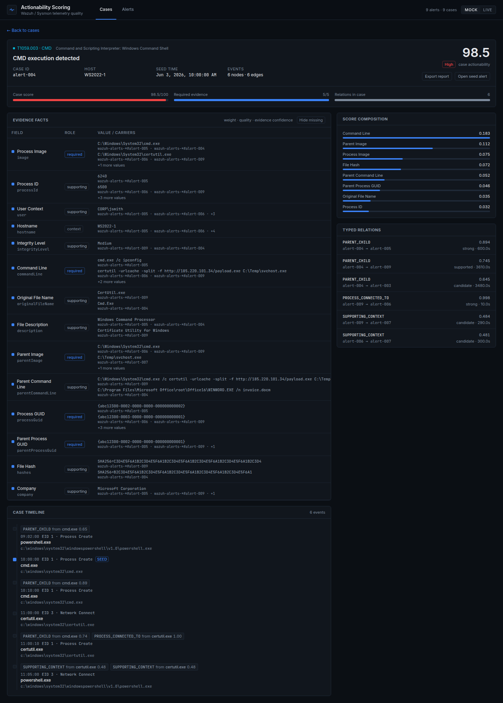
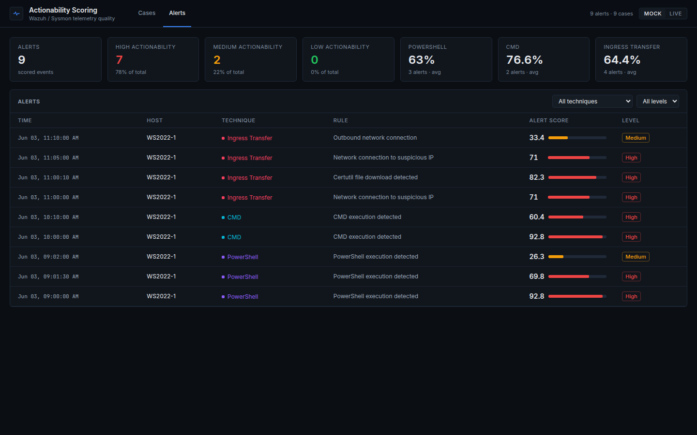
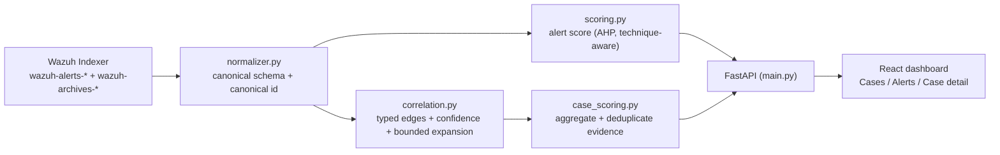

# Actionability Scoring

<p align="center">
  
</p>

<p align="center">
  <b>Score every Wazuh/Sysmon alert and correlated case from 0 to 100 on evidence completeness — not just whether an alert fired.</b><br>
  <sub>AHP-weighted · technique-aware · correlation-based actionability scoring.</sub>
</p>

<p align="center">
  <a href="#testing"></a>
  <a href="#quick-start"></a>
  <a href="#api-endpoints"></a>
  <a href="#dashboard"></a>
  
  
  <a href="https://github.com/kavakoss/actionability-scoring-dashboard/commits/main"></a>
</p>

---

## About

**Actionability Scoring** is a research prototype built for the thesis *Context-Aware Telemetry Observability Evaluation Agent for MITRE ATT&CK-Aligned Wazuh Events*. It is **not a detection tool**. It answers a different question:

> "Is this alert or case complete enough to investigate, or does an analyst still have to hunt through raw logs?"

The answer is a **0–100 actionability score**, computed both **per alert** and **per correlated case**.

### Why this exists

- Wazuh + Sysmon alerts are often **context-poor**: they indicate activity but miss command line, parent process, user, or network destination.
- ATT&CK mapping is not the same as detection quality (Shen et al., 2024), and SOC analysts already suffer from alert fatigue (Alahmadi et al., 2022).
- Telemetry quality is rarely measured quantitatively. This system provides that measurement and shows exactly which evidence is missing.

## Features

- **Alert-level actionability score** — field weights are derived with **AHP (Saaty)** and validated through the Consistency Ratio (< 0.10); scoring only counts the fields expected for the alert's technique.
- **Typed-edge correlation** — events are linked through typed, confidence-scored relationships (`SAME_PROCESS`, `PARENT_CHILD`, `SAME_BINARY`, `PROCESS_CONNECTED_TO`, `DESTINATION_SHARED`, …), not just matching fields.
- **Case-level actionability score** — evidence across correlated events is aggregated and deduplicated, then weighted by quality `Q` and relationship confidence `E`.
- **Bounded expansion** — the graph cannot explode: depth ≤ 3, node caps, context-leaf caps, and only identity-backed edges may recurse.
- **Critical-only seeds** — only alerts with `rule.level >= SEED_MIN_LEVEL` become cases; supporting evidence is still retrieved from anywhere in the indexer.
- **Console-style dashboard** — Cases and Alerts views, evidence table (W/Q/E plus event sources), typed relations, timeline with inline relation chips, Markdown case report export.
- **Mock/Live switch** — a deterministic demo without Wazuh, or live data from the Wazuh Indexer, switchable at runtime from the UI.
- **Reproducible artifacts** — `weights.json`, `AHP_RESULTS.md`, and `data/mitre_traceability.csv` (field → OSSEM → MITRE component → weight).
- **43 automated tests** — AHP, normalization, correlation, scoring, case scoring.

## Screenshots

Captured from **MOCK** mode (deterministic fixtures), so the demo is fully reproducible.

| Cases | Case detail |
|---|---|
|  |  |



In **Case detail** (second screenshot), the evidence table shows weight, quality `Q`, evidence confidence `E`, contribution, and source carriers (index + document id). The **Alerts** view (above) lists per-alert AHP scores with technique and level filters.

## How it works



1. **Ingest** — events are pulled from `wazuh-alerts-*` (and `wazuh-archives-*` for evidence) with `term` queries on keyword fields.
2. **Normalize** — Wazuh fields are mapped into a canonical schema (`process.guid`, `file.hash.sha256`, `destination.ip`, …) with canonical IDs so an event stored in both alerts and archives is never double-counted.
3. **Score (alert)** — `S_alert = 100 × Σ(w_f·A_f) / Σ w_f` over the technique's expected fields.
4. **Correlate** — event pairs are validated into typed relationships with confidence `C` and expanded within strict bounds.
5. **Score (case)** — evidence is aggregated, deduplicated, and scored as `Q × E` per fact.
6. **Serve** — FastAPI backend plus the React dashboard.

## Scoring model

Weights are generated from the pairwise matrices in `backend/ahp/matrices.py` and stored in `backend/weights.json` (single source of truth). Regenerate with:

```bash
cd backend
python -m ahp.run_ahp
# → weights.json, AHP_RESULTS.md, data/mitre_traceability.csv
```

**Alert score** — computed only over the technique's expected fields:

```text
w_f     = category_weight × local_field_weight          (global weight)
S_alert = 100 × Σ (w_f × A_f) / Σ w_f
A_f     = 1 when the field is present and non-empty, else 0
```

**Relationship confidence** (typed edge):

```text
C_r = 0.45·P + 0.20·T + 0.15·H + 0.10·S + 0.10·X
P = pivot strength, T = temporal decay e^(−Δt/τ),
H = host consistency, S = session/user consistency, X = corroborating evidence
```

**Case score** — cross-event evidence, deduplicated, weighted by quality and confidence:

```text
Q_f    = 0.30·C + 0.30·V + 0.25·K + 0.15·R
         C = completeness, V = validity, K = confidence-weighted corroboration,
         R = provenance
S_case = 100 × Σ (w_f × Q_f × E_f) / Σ w_f
E_f    = confidence of the seed → event path that carries the fact (1.0 for seed facts)
```

Levels: **Low < 25**, **Medium 25–50**, **High > 50** (provisional; calibrated during the evaluation phase).
The `required` / `supporting` / `context` roles are this study's operational classification, not official MITRE labels.

### Why a case can score 100 while an alert cannot

An EID 1 alert has no destination IP and an EID 3 alert has no command line, so alert scores are inherently bounded by event type. The case score combines EID 1 and EID 3 from the same process, satisfying all expected evidence. That is where correlation adds value.

## Correlation model

- **Pivot strengths**: `process.guid` 1.00, `parent.child.guid` 0.98, SHA-256 0.95, destination tuple 0.80, destination IP only 0.45, user 0.35.
- **Typed relations**: `SAME_PROCESS`, `PARENT_CHILD`, `SAME_BINARY`, `PROCESS_CONNECTED_TO`, `PROCESS_QUERIED_DNS`, `PROCESS_CREATED_FILE`, `PROCESS_MODIFIED_REGISTRY`, `PROCESS_TERMINATED`, `DESTINATION_SHARED`, `SUPPORTING_CONTEXT`.
- **Bounded expansion**: depth ≤ 3; only identity-backed edges recurse; scope/context edges never become expansion points, which prevents graph explosion.
- **Deduplication**: repeated evidence becomes one fact with an `occurrences` count plus a bounded carrier list, so hundreds of identical network events cannot inflate the score.
- **Caps**: at most 5 context leaves per node; consistency counts only the three strongest carriers (identity full weight, context half).

## Seed policy (live)

- Only alerts with `rule.level >= SEED_MIN_LEVEL` (default 15; configurable via env or API) become **seeds/cases**. Non-critical alerts are not displayed.
- **Supporting evidence is unrestricted**: opening a seed triggers a bounded expansion across `wazuh-alerts-*` **and** `wazuh-archives-*` — same process, parent/child, hash, destination, user — so context can come from any event.
- Change the threshold in `.env`, or call `POST /api/source {"source": "live", "seed_min_level": 12}`.
- The level filter applies to live mode only; mock mode always loads the full fixture set.

## Quick Start

### Docker (nginx, port 8080)

```bash
git clone https://github.com/kavakoss/actionability-scoring-dashboard.git
cd actionability-scoring-dashboard
cp backend/.env.example backend/.env   # edit only when using a real Indexer
docker-compose up --build
```

| URL | Description |
|---|---|
| `http://localhost:8080` | React dashboard |
| `http://localhost:8080/docs` | Swagger API |
| `http://localhost:8080/api/health` | Health check |

```bash
docker-compose down   # stop
```

### Manual (development)

```bash
# terminal 1 — backend
cd backend
python -m venv .venv && source .venv/bin/activate
pip install -r requirements.txt
python main.py                                  # http://localhost:8000

# terminal 2 — frontend
cd frontend
npm install
npm run dev                                     # http://localhost:3000
```

The Vite dev server proxies `/api` to `http://localhost:8000` (override with `VITE_API_TARGET`).

### Testing

```bash
cd backend
pytest -q          # 43 tests: AHP, normalizer, correlation, scoring, case scoring
```

## Dashboard

### Cases (default)
- Correlated cases ranked by case score, with required-evidence coverage and graph size.
- Filter by technique and level.

### Case detail
- Case score, required coverage, node/edge counts.
- Evidence facts: field, role, AHP weight, `Q`, `E`, contribution, and carriers (value plus source index/document id).
- **Hide missing** toggle and **Export report** (Markdown).
- Score composition and typed relations (relation, confidence, decision).
- Case timeline with inline relation chips.
- Deep links: `?view=cases&case=<id>`, `?view=alerts&alert=<id>`.

### Alerts
- Per-alert AHP score with technique/level filters.
- Click an alert for the per-category breakdown (identity, behavioral, relationship, IOC, network, timeline) with the MITRE data component for each field.

## API Endpoints

| Method | Endpoint | Description |
|---|---|---|
| GET | `/api/health` | Health check + current source + `seed_min_level` |
| GET | `/api/source` | Current source, availability, config |
| POST | `/api/source` | Switch source: `{"source": "mock" \| "live", "seed_min_level": 12}` |
| GET | `/api/alerts` | List seed alerts (`?technique=&level=&agent=&sort_by=score`) |
| GET | `/api/alerts/{id}` | Alert detail + full scoring breakdown |
| GET | `/api/cases` | List cases + case-level score (`?technique=&level=`) |
| GET | `/api/cases/{case_id}` | Case detail: per-fact evidence (Q, E, carriers) + required coverage |
| GET | `/api/timeline/{id}` | Timeline (nodes + typed edges), expansion-based when available |
| POST | `/api/webhook` | Wazuh integration: alert → bounded expansion → case score |
| GET | `/api/stats` | Aggregate statistics |
| GET | `/docs` | Swagger UI |

## Paper artifacts

| File | Contents | Used for |
|---|---|---|
| `backend/weights.json` | Final AHP weights (per category and field) | single source of truth |
| `backend/AHP_RESULTS.md` | All pairwise matrices, λmax, CI, CR, global weights | appendix + methodology |
| `backend/data/mitre_traceability.csv` | `technique → field → role → weight → Wazuh path → OSSEM → MITRE component` | content validity |
| `backend/field_metadata.py` | Field mapping source | reproducibility |
| `backend/technique_profiles.py` | Expected fields per technique with data-source citations | methodology |
| `evaluation/` | ART runbook, orchestrator script, `runs.csv` template | evaluation chapter |

## Project structure

```
actionability-scoring-dashboard/
├── backend/
│   ├── main.py                # FastAPI server + source switching + seed policy
│   ├── normalizer.py          # canonical schema (OSSEM-referenced)
│   ├── correlation.py         # typed edges, confidence, bounded expansion
│   ├── case_scoring.py        # case-level Q/E scoring + caps
│   ├── scoring.py             # alert-level AHP scoring (technique-aware)
│   ├── field_metadata.py      # Wazuh path → OSSEM → MITRE component
│   ├── technique_profiles.py  # expected fields per ATT&CK technique
│   ├── wazuh_client.py        # OpenSearch client, pivot queries
│   ├── mock_data.py           # mock alerts (deterministic demo/tests)
│   ├── ahp/                   # AHP core, pairwise matrices, generator
│   ├── data/                  # generated: traceability CSV
│   ├── weights.json           # generated: AHP weights
│   ├── AHP_RESULTS.md         # generated: full AHP report
│   ├── live_demo.py           # CLI: bounded live case expansion
│   ├── tests/                 # pytest suite (43 tests)
│   └── requirements.txt
├── frontend/
│   └── src/
│       ├── App.jsx            # shell, tabs, source toggle, deep links
│       ├── api.js
│       └── components/
│           ├── CasesView.jsx      # case list
│           ├── CaseDetail.jsx     # case score + evidence + export
│           ├── TimelineView.jsx   # timeline with inline relation chips
│           ├── ScoringDashboard.jsx / AlertDetail.jsx / StatsOverview.jsx
│           └── ui.jsx             # design primitives
├── evaluation/
│   ├── ART_RUNBOOK.md         # manual ART procedure
│   ├── runs.csv               # run log template
│   └── windows/
│       ├── Invoke-ArtPlan.ps1 # ART orchestrator (Pilot/Unattended)
│       └── STEP-BY-STEP.md    # operator guide
├── docs/
│   ├── banner.svg
│   └── screenshots/
├── nginx/                     # reverse proxy for docker-compose
└── docker-compose.yml
```

## Limitations

- Single-host lab with three techniques (T1059.001, T1059.003, T1105) and Sysmon EID 1/3/5 only.
- Sysmon EID 22 (DNS) is effectively absent, so the DNS pivot is unused; registry, file, and pipe pivots are also unavailable.
- The live SHA-256 pivot uses an exact `term` on `hashes`; the lab stores a single SHA256 per field. If Sysmon is configured to emit multiple algorithms in one string, ingest normalization or a fallback query is required.
- EID 5 (Process Termination) is **not** part of scoring (not an ATT&CK data component for these techniques) — it is used for correlation/lifetime only.
- Archive retention is limited; Process Create records for processes started before the archive window are missing, which can break lineage.
- `originalFileName` and `signatureStatus` have no OSSEM CDM attribute (noted in the traceability CSV).
- The `required` / `supporting` / `context` roles are a study-defined operational classification, not official MITRE labels.
- Low/Medium/High thresholds are provisional until calibrated in the evaluation phase.
- The score measures **evidence completeness**, not maliciousness; an adversary who populates fields can raise it.
- The API has no authentication yet; run it only on a trusted lab network or Tailscale, never on the public internet.

## Status & roadmap

| Phase | Status |
|---|---|
| Normalizer + typed-edge correlation engine | done |
| AHP weights + technique profiles + traceability artifacts | done |
| Alert-level + case-level scoring | done |
| Dashboard (Cases/Alerts/Case detail) + MOCK/LIVE switch | done |
| Critical-only seed policy + unrestricted case evidence | done |
| ART runbook + orchestrator for labeled data | done |
| Evaluation: sensitivity A/B, correlation ablation, discrimination, threshold calibration, weight perturbation | in progress |
| Paper writing (results and discussion) | upcoming |

## Troubleshooting

| Problem | Fix |
|---|---|
| Backend will not start (port 8000 in use) | Change the port in `main.py` (`uvicorn.run(app, port=8001)`) |
| Frontend cannot reach the API | Make sure the backend is running; check `VITE_API_TARGET` / `vite.config.js` |
| `npm install` fails | Try `npm install --legacy-peer-deps` |
| Live mode empty or erroring | Check `last_error` in `/api/health`; verify `.env` and Indexer connectivity |
| Live dashboard empty although alerts exist | Lower `SEED_MIN_LEVEL` (this lab currently peaks at level 12) |
| Blank page | Check the browser console (F12) |

## Authors

Jason Tanuwidjaja · Johan Davin Hermawan · Kevin Diaz Pramono — Computer Science, Bina Nusantara University.

Thesis: *Context-Aware Telemetry Observability Evaluation Agent for MITRE ATT&CK-Aligned Wazuh Events*.
