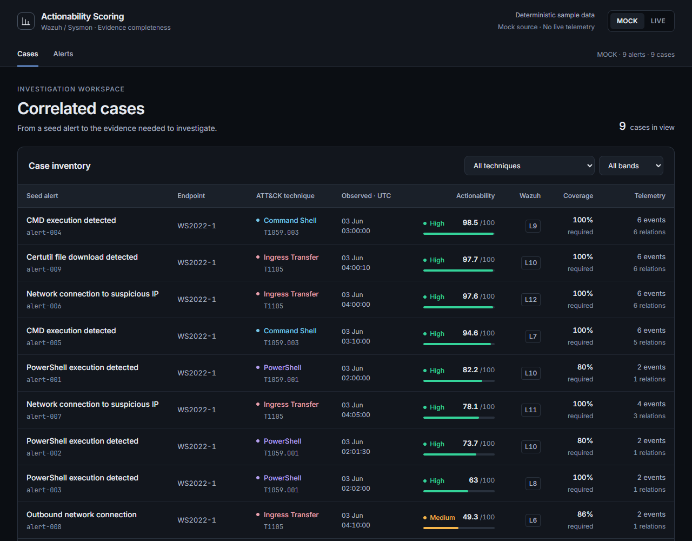
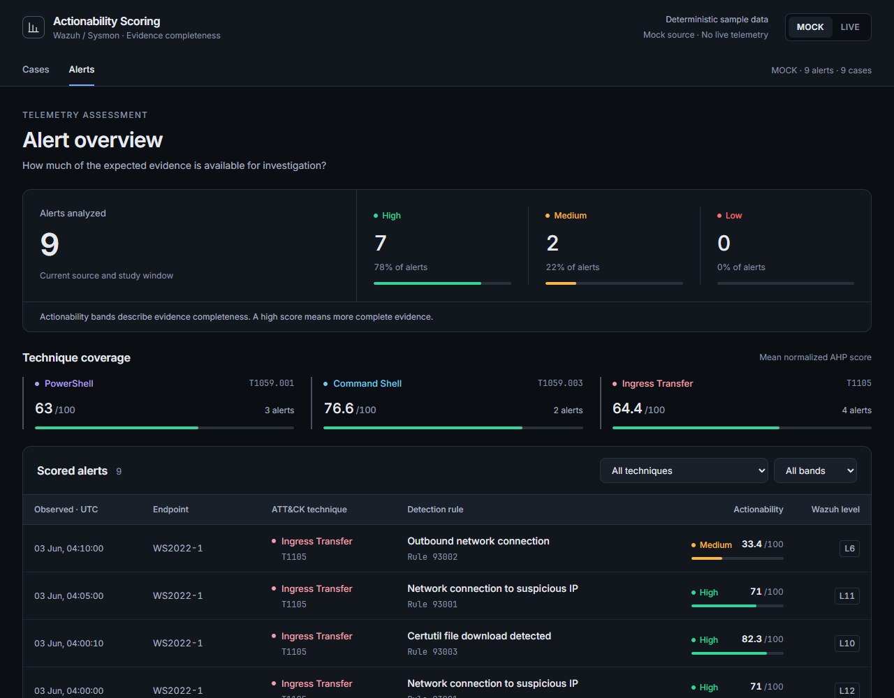
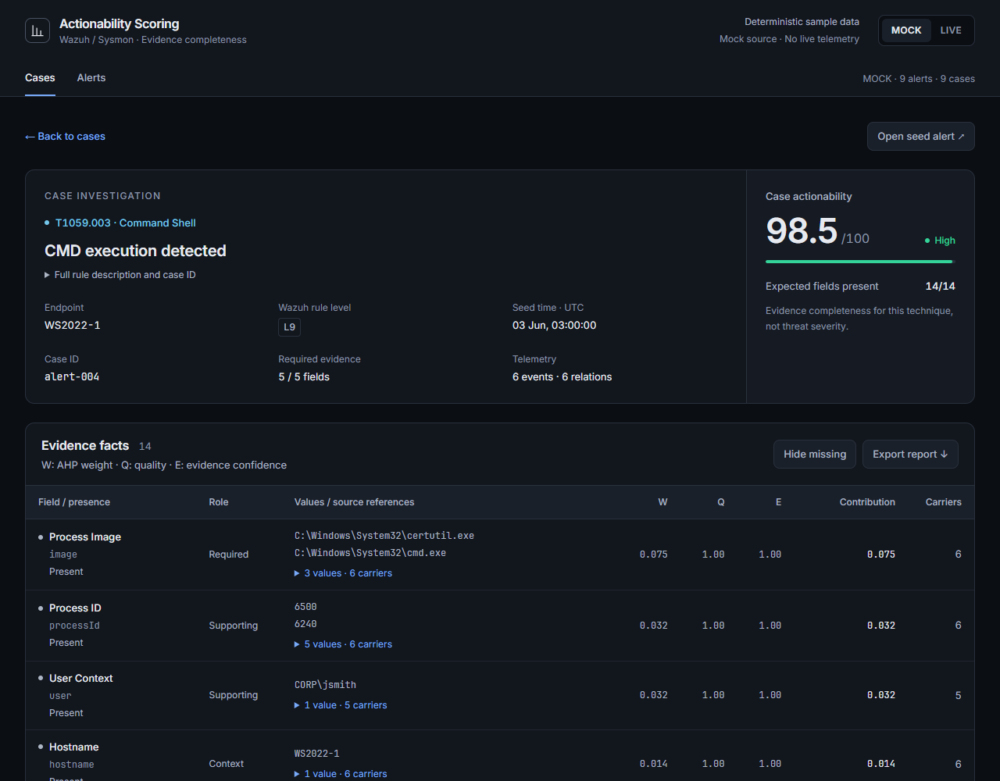
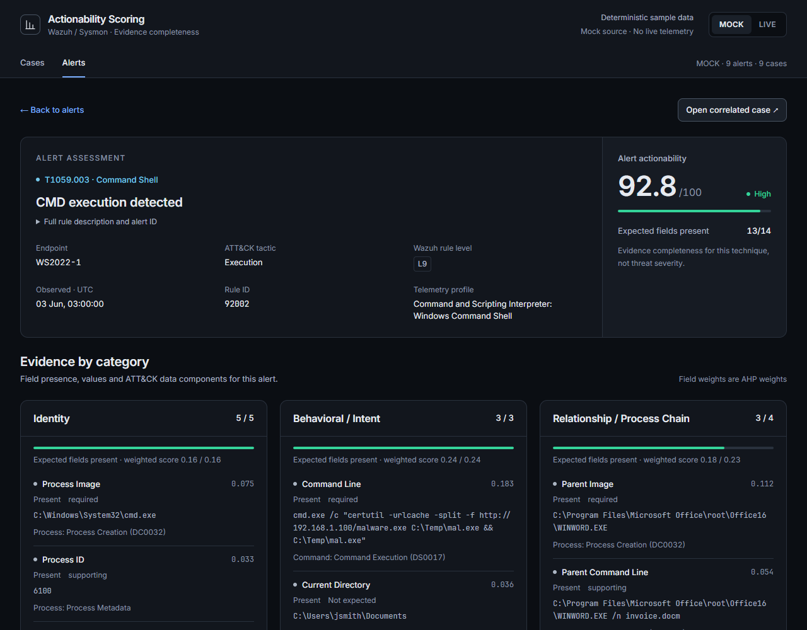

# Dashboard UI refresh — review preview

Branch: `ui/dashboard-refresh-review`, based on `main` at `e822432`.
This proposal updates the frontend presentation. Backend scoring, correlation,
API endpoints and response shapes remain unchanged.

The screenshots below use the deterministic MOCK source at 1280px. They show
the proposed layout without requiring a Wazuh connection. Design tokens,
accessibility decisions and validation results are in [UI notes](UI-NOTES.md).

## Cases



## Alerts



## Case detail



Below the evidence table, the interactive page includes the process creation
tree, contribution bars, typed relations and chronological event order. Process
details expand to show the events grouped under each process.

## Alert detail



## Try it locally

Use a separate clone to review this branch alongside an existing checkout:

```sh
git clone --branch ui/dashboard-refresh-review --single-branch https://github.com/kavakoss/actionability-scoring-dashboard.git actionability-ui-review
cd actionability-ui-review
```

Follow the [Quick start](../README.md#quick-start) to install and run the backend
and frontend. A fresh clone defaults to MOCK mode and needs no Wazuh credentials.
If you reuse an existing environment, set `USE_LIVE_WAZUH=false` for this preview.

Review Cases, Alerts, a case detail and an alert detail. Try the technique/band
filters, evidence disclosures, hide-missing toggle, report export and process
event disclosures. Query-parameter links continue to work after refreshing.

From `frontend/`, verification commands are:

```sh
npm run build
node --test tests/processTreeModel.test.mjs
```

The build and four process-tree tests passed. Browser validation also passed 22
checks, including LIVE views at 1280px and 1440px, MOCK views, compact layouts,
keyboard focus, reduced motion, source switching, filters and report export.
